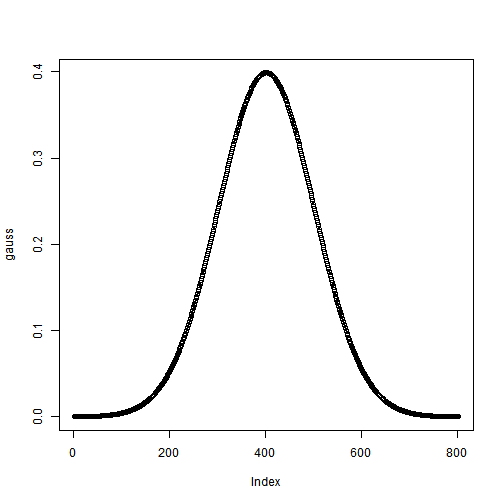
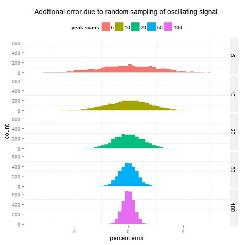

# Examples and analysis of oscillation in QE-Plus signal
The Q-Exactive Plus exhibits a large oscillation (20% peak to trough) in signal intensity on a second timescale.  Here we look at some of the characteristics of that variation. **Notably** this variation is not stochastic, the variation exhbits a distinct period of between 0.5 and 2 seconds (corresponding to 8 to 20 scans).  This signal fluctuation is stable, reproducible and large. 

This suggests that it is a design flaw of the instrument which could be fixed.

# Data Collected
We collected direct infusion data from a syringe pump at various flow rates and instrument settings.  Here is an overview of the data and a zoomed and 3 point moving averaged region.

```r
tic = unname(unlist(read.csv("infusion1.tic.csv", header=F)))
plot(tic, type="l")
```

 

```r
plot(tic[5554:5800], type="l")
```

 

```r
plot(filter(tic[5554:5800], c(1,1,1)/3), type="l")
```

 

The different experimental conditions tested and their start scan are listed here.  Different flow rates were assessed to exclude the syringe pump as a possible source of fluctuation.  Other parameters were assessed to see if anything correlated with the oscillations.

```r
seg = read.csv("segments.csv")
seg
```

```
##     X                   label start
## 1   1                   50 uL     0
## 2   2                   40 uL   835
## 3   3                   30 uL  1223
## 4   4                   10 uL  1674
## 5   5                 30 uL 2  2465
## 6   6               45 sheath  3196
## 7   7               35 sheath  3442
## 8   8               25 sheath  3745
## 9   9               20 sheath  4392
## 10 10         3.5V, 20 sheath  4638
## 11 11 3.3V, 20 sheath, 10 aux  5132
## 12 12 3.3V, 20 sheath, 20 aux  5554
```

## Quick FT to find period
The most distinct aspect of this signal is its period.  We do a quick FT to approximate the period of the oscillation.

```r
tic.1 = tic[5554:5800]
plot(filter(tic.1, rep(1,6)/6), type="l")
```

 

```r
ff = fft(scale(tic.1))
periodogram = cbind(
  freq = 1:length(ff)/length(ff),
  ff = abs(ff)^2/length(ff)
  )
plot(periodogram[1:100,], type="l")
```

 

```r
best = periodogram[which.max(periodogram[,2]),]
1/best[1]
```

```
##     freq 
## 17.64286
```

```r
freq = 1/best[1]
```

## FT to freq function
Just a quick function that takes a time series and outputs the frequency with the most power.

```r
find.freq = function(x) {
  
  ff = fft(scale(x))
  periodogram = cbind(
    freq = 1:length(ff)/length(ff),
    ff = abs(ff)^2/length(ff)
    )

  1/periodogram[which.max(periodogram[,2]),1]
  }
```

## For each condition find the frequency

```r
tic.l = lapply(seq(nrow(seg)), function(i) {
  s = seg[i,"start"]+10
  d = diff(seg[,"start"])[i]-100
  d[d>200] = 200
  d[is.na(d)] = 200

  as.numeric(na.omit(filter(tic[s:(s+d)], rep(1,3)/3)))
  #as.numeric(tic[s:(s+d)])
  })

freq.l = lapply(tic.l, find.freq)

seg = cbind(seg, freq = unlist(freq.l))
seg
```

```
##     X                   label start      freq
## 1   1                   50 uL     0  8.652174
## 2   2                   40 uL   835  8.652174
## 3   3                   30 uL  1223  8.291667
## 4   4                   10 uL  1674  5.685714
## 5   5                 30 uL 2  2465  8.652174
## 6   6               45 sheath  3196  1.082090
## 7   7               35 sheath  3442  7.960000
## 8   8               25 sheath  3745 18.090909
## 9   9               20 sheath  4392 11.153846
## 10 10         3.5V, 20 sheath  4638  9.950000
## 11 11 3.3V, 20 sheath, 10 aux  5132 11.705882
## 12 12 3.3V, 20 sheath, 20 aux  5554 18.090909
```
We can see that the frequency of oscillation responded to some of the conditions.  The oscillation was unaffected by the syringe pump flow between 30-50 uL/min. **Notably the oscillation was affected by the gas flow rates.**  Visuals below.

(10 uL/min was tested but unable to maintain flow - see plots below)

## Visual Plots


```r
library(ggplot2)

df = reshape2::melt(lapply(tic.l, lapply, c))
df$L1 = factor(df$L1, labels = seg[,"label"])
colnames(df)[3] = "label"

ggplot() +
  geom_line(data=df, aes(y = value, x= L2, group = label)) +
  facet_wrap(~label, scales = "free_y", ncol=2) + theme_nate(12) + geom_text(data = seg, aes(x = 50, y= 1.3E9, group = NULL, label=paste(sep="", "Frequency: ", round(freq,1))))
```

 

## Conclusions
 - There is a reproducible and large osillation in the QE signal (20% peak to trough)
 - The oscillation is independent of the syringe pump
 - Changes in gas flow rates appear to alter the oscillation period
 - These results suggest there is a design flaw which could be fixed
 - **Or** these results suggest there is a defect in our instrument which should be fixed.
 - Based on other tests I do not think this is AGC related

# Additional Information and Examples
## Statistics
This mostly averages out as you get more scans across a peak.  But as peaks narrow and scans across a peak are fewer this will increase observed CVs.


```r
gauss<-dnorm(seq(-4,4,.01), 0,1)
plot(gauss)
```

 

```r
peak.scan.l = c(5, 10, 20, 50, 100)
tic.dist = tic.l[[5]]
tic.mean = mean(tic.dist)

samples = lapply(peak.scan.l, function(scs) {
  sapply(1:1000, function(i) {
    gs = gauss[round(seq(1, length(gauss), by = length(gauss)/scs))]
    measurements = sample(tic.dist, length(gs))
    
    err = sum(gs * measurements)
    ideal = sum(gs * tic.mean)
    
    (err-ideal)/ideal
    })
  })

df = reshape2::melt(samples)
colnames(df) = c("percent.error", "peak.scans")
df$peak.scans = factor(df$peak.scans, labels = as.character(peak.scan.l))

ggplot(df, aes(x = percent.error, fill = peak.scans)) + geom_histogram() + facet_grid(peak.scans~.) + theme_nate(12) + ggtitle("Additional error due to random sampling of oscillating signal.")
```

 

## Lower sample rates
At lower sample rates (such as the 1 scan per second we generally sample at) this problem looks much more stochastic, and is the variation we originally described and were frustrated with.


```r
tic.s = tic.l[[5]]
plot(tic.s, type="l")
```

 

```r
plot(tic.s[seq(1, length(tic.s), 10)], type="l")
```

 


# Other notable observations
These are two questions I have about the system.  I would like to discuss them with someone.

## Mass range limitation
A mass range is selected when running the QE, only masses within that range are recorded.  The upper mass is limited to 15x the lower mass.  This seems arbitrary - why?

If the signal of high or low mass compounds is attenuated by the C-trap it seems that some signal would be much better than none.  Why discard that useful signal?

It is a mistaske to assume that only masses with your selected range reach the Orbi, but maybe that constraint simplifies the FT. (Can't imagine, just guessing.)  

In addition to discarding useful data, not reporting that information could have other effects (below).

## Only masses within the set mass range impact the AGC calculation
Only masses within the set mass range are reported in the data.  It appears that only these masses are used for the AGC calculation.  

Observation: when moving from a mass range of 60-700 to 50-700 the 59 peak of acetate (3E9 NL) is added and removed from the reported mass range.  The injection time for each of these mass ranges is 2.1 ms and 0.5 ms, respectively.  It is clear that the quad is not filtering 75% of the acetate peak with a 1 Dalton shift. Your wide quad isolation windows take about 10 Da (estimation) to go from 100% to 5% transmittion.  This additional charge density which is unreported could mess up your space charge corrections, etc.
